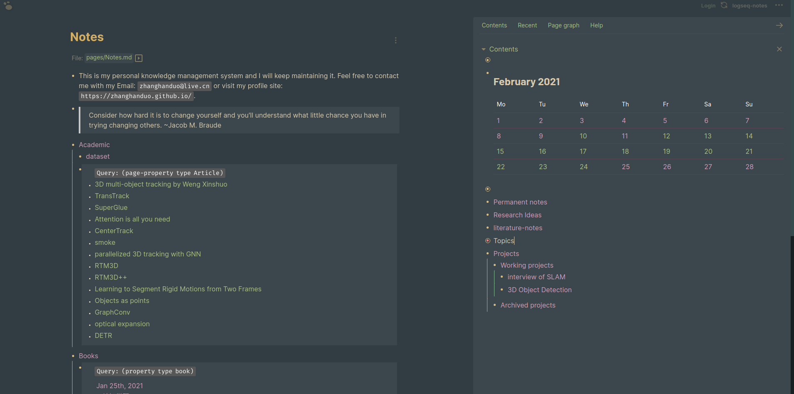

# Forest Night Theme for Logseq

This is my first [logseq](logseq.com) theme based on [Sacred Forest](https://github.com/karoliskoncevicius/sacredforest-vim) color scheme for VIM.

From the name you will know this mainly focuses on the dark theme.

## Installation

You can either copy the `custom.css` into the `logseq` folder under you logseq notes, or just copy-paste into the **stylus** chrome extension (recommended).

## Acknoledgement

I use [logseq](logseq.com) every day and it is really an amazing tool to boost my work. 

This is an ugly clone from [Cobra](https://github.com/santiyounger/Cobra) without asking for permission. So you can see the structure of the code was barely changed. 

I know little of CSS so I have to copy all the stuff from [Cobra](https://github.com/santiyounger/Cobra) and [dark-hpx](https://github.com/cannibalox/logseq-dark-hpx), and adopt to my favorite color palette. 

Thank you [Anti](https://github.com/santiyounger) and [Cannibalox](https://github.com/cannibalox)!

## Inspriation

- [KKPMW/sacredforest-vim](https://github.com/karoliskoncevicius/sacredforest-vim)
