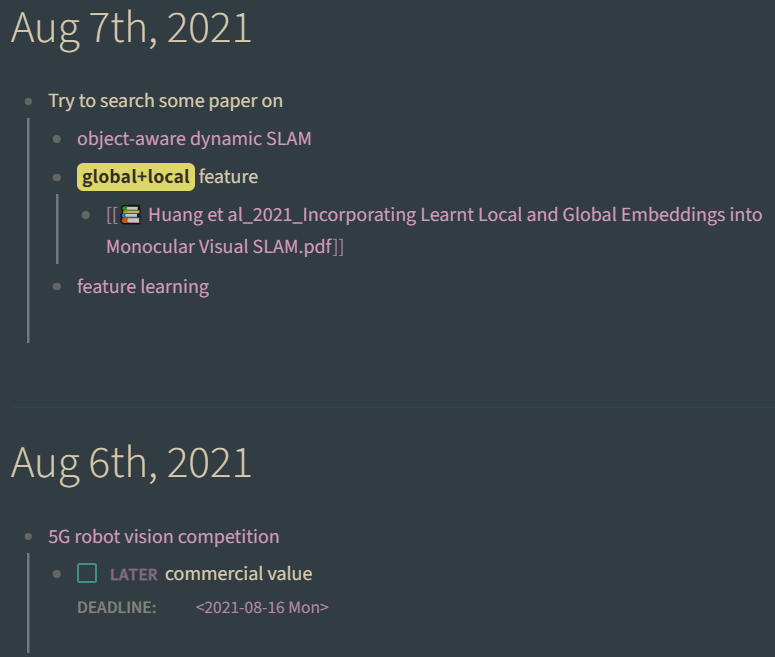
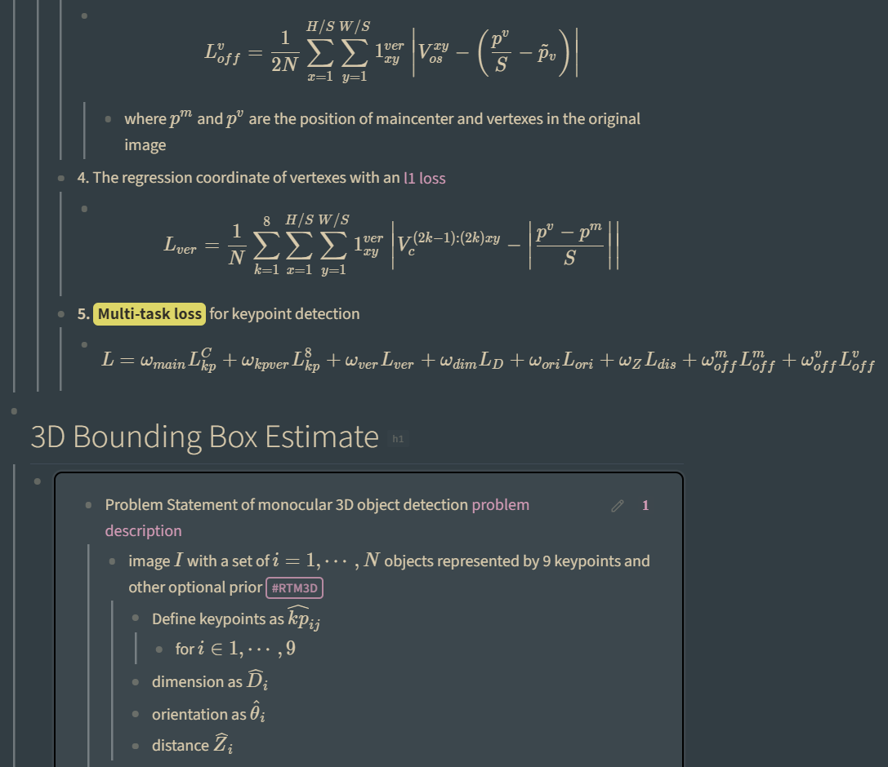
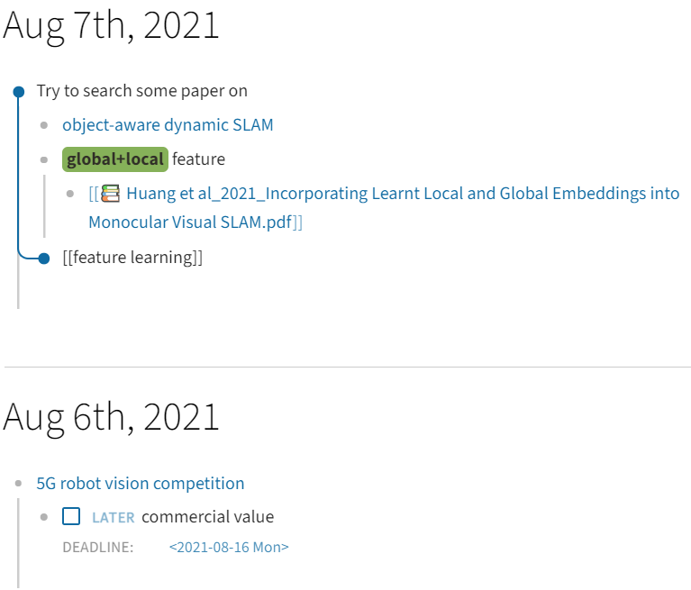
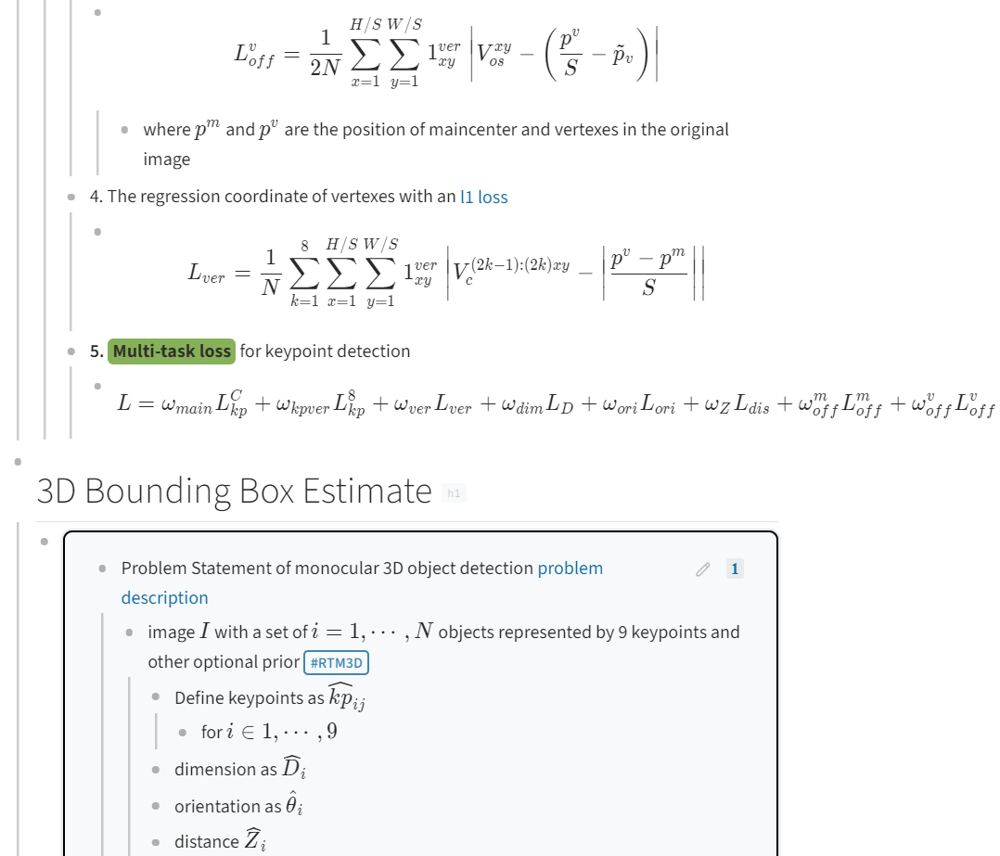

# Forest Night Theme for Logseq

This is my customized [logseq](logseq.com) theme based on [Sacred Forest](https://github.com/karoliskoncevicius/sacredforest-vim) color scheme for VIM as well as the marvelous logseq [Dev Theme](https://github.com/pengx17/logseq-dev-theme).

Forest Night Screenshot

Forest Daytime Screenshot

## Acknowledgement

I use [logseq](logseq.com) every day and it is really an amazing tool to boost my work. 

This can be thought as a fork of [Dev Theme](https://github.com/pengx17/logseq-dev-theme).

## Inspriation

- [KKPMW/sacredforest-vim](https://github.com/karoliskoncevicius/sacredforest-vim)
