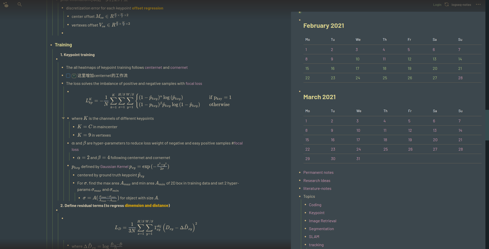
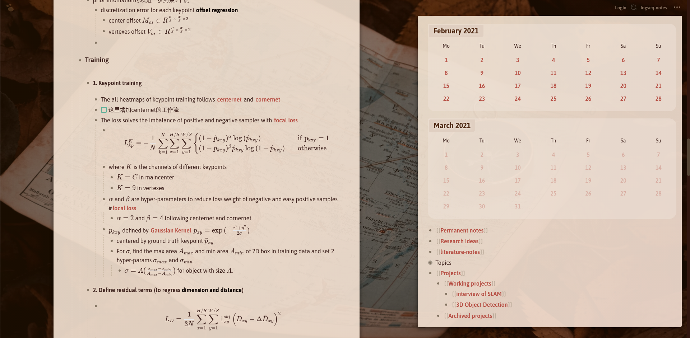
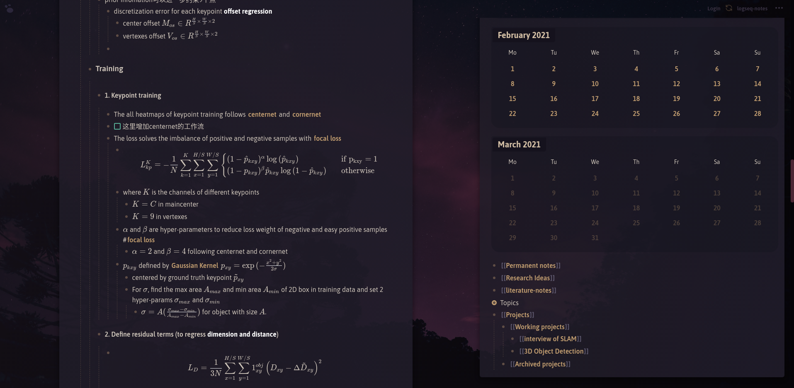

# Forest Night Theme for Logseq

This is my first [logseq](logseq.com) theme based on [Sacred Forest](https://github.com/karoliskoncevicius/sacredforest-vim) color scheme for VIM.

From the name you will know this mainly focuses on the dark theme.

Forest Night Screenshot

Background image Screenshot (adjusted from [clean themes](https://github.com/PiotrSss/logseq-clean-themes/blob/main/bg.css))

 - white theme

 - dark theme

## Installation

There are 3 css files: `forest_full.css`, `forest_slim.css` and `bg_img_custom.css`.

- 1. `forest_slim.css` has the basic color scheme of **forest night**.

- 2. `forest_full.css` adds 3 standalone features on top of `custom_slim.css`

    * add number list by adding inline tag `#numlist`.
    * add Kanban feature by adding inline tag `#kanban`, `#kanban-small`, `#kanban-w100`, `#kanban-w200`, `#kanban-w300`, or `#kanban-w400`.
    * highlight current path.
  
    > Note that these features are all integrated from [here](https://github.com/cannibalox/logseq-dark-hpx).

- 3. `bg_img_custom.css` absorbs the awesome theme of [clean themes](https://github.com/PiotrSss/logseq-clean-themes/blob/main/bg.css) from [PiotrSss](https://github.com/PiotrSss). 
    * I added some tiny polishes and change the _imgur_ img host to _sm.ms_
    * I also added 3 features (mentioned above) on top of it.
    * If you want to change the background theme, just go to `bg_img_custom.css` and scroll down to the last paragraph.
    * Change the url of background picture.

- You can rename either of them to `custom.css` and copy into the `logseq` folder under you logseq notes.

- Alternatively you could just copy-paste them into the **stylus** chrome extension to see an instant style preview (**recommended**).

## Roadmap

 - [ ] Add colorful indention to differentiate different levels (current hacking looks ugly so I temporarily removed it)
 - [ ] Keep on fine-tuning the colors of some non-salient places
 - [ ] Develop a beautiful theme for white mode

## Acknowledgement

I use [logseq](logseq.com) every day and it is really an amazing tool to boost my work. 

This can be thought as a fork of [darker-hpx](https://github.com/cannibalox/logseq-dark-hpx/blob/master/logseq-darker-hpx.css) and [clean theme](https://github.com/PiotrSss/logseq-clean-themes).

I know little of CSS so I have to copy much stuff from them and adopt to my favorite color palette. 

Thank you [Piotr](https://github.com/PiotrSss), [Cannibalox](https://github.com/cannibalox), and [Santi](https://github.com/santiyounger)!

## Inspriation

- [KKPMW/sacredforest-vim](https://github.com/karoliskoncevicius/sacredforest-vim)
